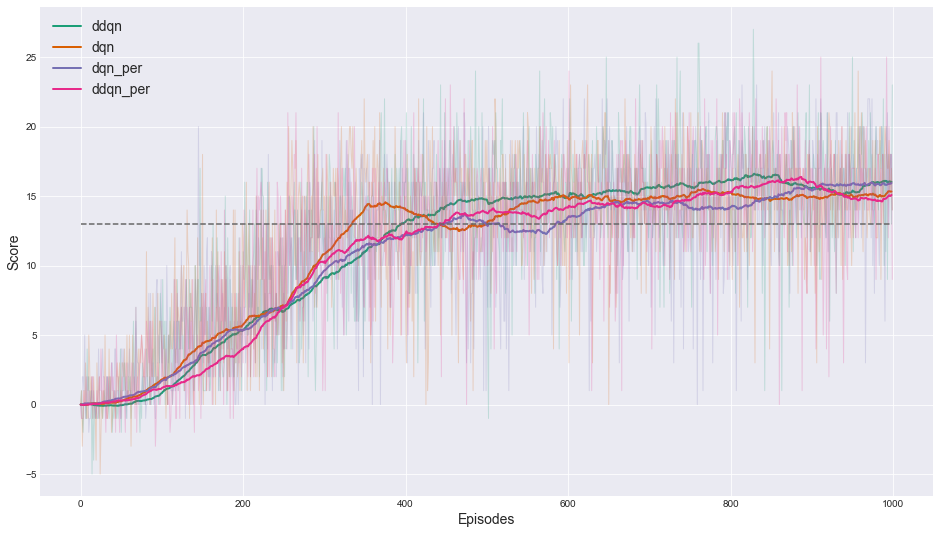
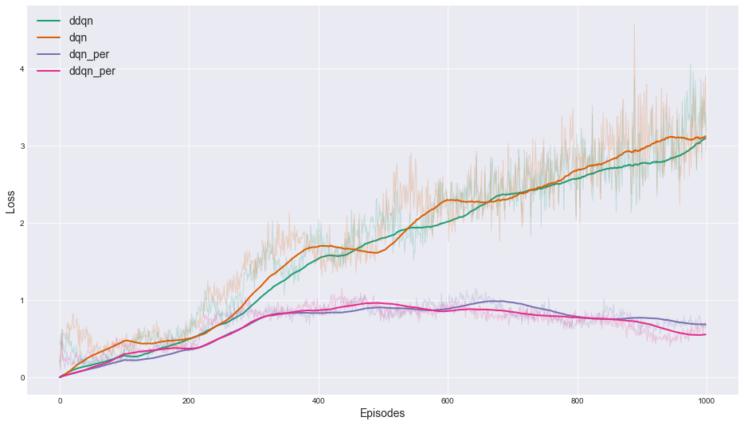

# Udacity Deep Reinforcment Learning Nanodegree: project 1

## 1 - Introduction
For this project, you will train an agent to navigate (and collect bananas!) in a large, square world.

Trained Agent

A reward of +1 is provided for collecting a yellow banana, and a reward of -1 is provided for collecting a blue banana. Thus, the goal of your agent is to collect as many yellow bananas as possible while avoiding blue bananas.

The state space has 37 dimensions and contains the agent's velocity, along with ray-based perception of objects around agent's forward direction. Given this information, the agent has to learn how to best select actions. Four discrete actions are available, corresponding to:

- `0` - move forward.
- `1` - move backward.
- `2` - turn left.
- `3` - turn right.

The task is episodic, and in order to solve the environment, your agent must get an average score of +13 over 100 consecutive episodes.

## 2 - Project Structure
- folder `Banana_env` contains simple banana environment with continuous state space
- folder `VisualBanana_env` contains banana environment with pixel state representation (`84*84` RGB image) 
- folder `data/models` contains saved trained models
- folder `reports` contains saved training scores
- folder `src` contains all source code
  - `replay_buffer.py` contains 2 classes for experience replay: `ReplayBuffer` for regular experience replay, and `PrioritizedReplayBuffer` for prioritized experience replay
  - `neural_net.py` contains simple MLP and Convolution NNs
  - `environment.py` contains wrappers for 2 environments presented in this project
  - `agent.py` contains implementations of 4 algorithms: DQN, Double DQN, DQN+PER, Double DQN+PER
  - `dqn.py` contains common dqn routine used for training all the agents
  - `train.py`  script for training any presented agent in any of 2 environments
  - `play.py`  script for running trained agent
  - `plot_graphs.ipynb`  notebook for plotting training scores

## 3 - Implementation Notes

These are changes that seem to improve training procedure:
- Decay learning rate each 100 episode by 0.8: `lr = lr*0.8`
This helps to keep agent's and target networks similar to each other and prevents loss increase significantly, which lead to more stable training
- For Prioritized Experience Replay push most recent samples that have not been used in training yet in the next minibatch and then after the update push them into the sum tree structure with new probabilities. This lets us forget about initial probabilities for new samples and also follows the idea that new samples reflect the actual agents policy and probably has a greater potential to learn something from them.

## 4 - Experiment Settings

These are hyperparameters used in the training:

Agent |Learning rate |Learning rate decay| Epsilon initial | Epsilon decay | Epsilon min | Minibatch size | Gamma | Tau
---|---|---|---|---|---|---|---|---
DQN             |5e-4|0.8|1.0|0.95|0.01|100|0.99|0.001
Double DQN      |5e-4|0.8|1.0|0.95|0.01|100|0.99|0.001
DQN + PER       |5e-4|0.8|1.0|0.95|0.01|100|0.99|0.001
Double DQN + PER|5e-4|0.8|1.0|0.95|0.01|100|0.99|0.001

## 5 - Experiment Results

### 5.1 - Simple Banana Environment

Following are training results on the simple banana environment.

