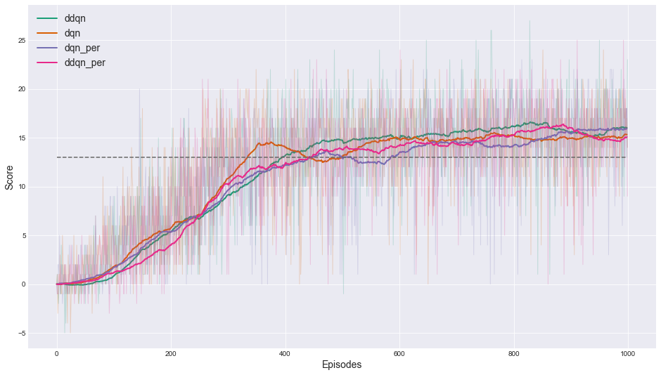

# Udacity Deep Reinforcment Learning Nanodegree: project 1

## 1 - Algorithms
In this project I implemented DQN and Double DQN. Also, I added Prioritized Replay Buffer as an optional 
feature, that can be used in both algorithms. Overall, there are 4 possible setups:
1) DQN
2) Double DQN
3) DQN + PER
4) Double DQn + PER

#### DQN

**Idea**. Use neural network for Q-value function approximation as `state` -> `action` mapping with the following loss function minimised:


#### Double DQN (DDQN)

**Idea**. Use neural network for Q-value function approximation as `state` -> `action` mapping with the following loss function minimised:


Implementation of both DQN and DDQN can be found in file `agent.py`:

#### Prioritized Expreience Replay (PER)

**Idea**. 
For memory replay, the agent collects tuples of `(state, reward, next_state, action, done)` and reuses them for future learning. In case of prioritised replay the agent has to assign priority to each tuple, corresponding to their contribution to learning. After that, these tuples are reused based on their priorities, leading to more efficient learning.


## 2 - Implementation Notes

These are changes that seem to improve training procedure:
- Decay learning rate each 100 episode by 0.8: `lr = lr*0.8`
This helps to keep agent's and target networks similar to each other and prevents loss increase significantly, which lead to more stable training
- For Prioritized Experience Replay push most recent samples that have not been used in training yet in the next minibatch and then after the update push them into the sum tree structure with new probabilities. This lets us forget about initial probabilities for new samples and also follows the idea that new samples reflect the actual agents policy and probably has a greater potential to learn something from them.

## 3 - Experiment Results and Discussion

#### 3.1 - Simple Banana Environment

Following are training results on the simple banana environment.




In all cases the environment has been solved in less then 600 episodes. 
However, I personally find all of these algorithms too sensitive to hyperparameters settings, and even worse to random
seed used in neural net's initialization, replay buffer and environment.
Thus, two consecutive runs with no change but different seeds could end up with completely different results.

In the future work, I would investigate this issue.

#### 3.2 - Visual Banana Environment

I couldn't get it solved. My best shot was with the average score around 11.

In future, I would probably fine-tune the algorithm for this particular environment.

## 4 - Play
To play the trained agent, you need to run the following script

>```console
> (drlnd) $ python3 ./play.py --env_file=[path to the environment file] --agent_fname=[path to the saved agent's file]
>``` 

Trained agents could be found in the `data/models/simple` folder.